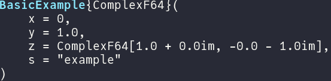
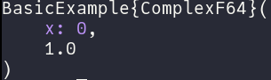
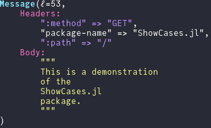

# ShowCases

[](https://ExpandingMan.gitlab.io/ShowCases.jl/)
[](https://gitlab.com/ExpandingMan/ShowCases.jl/-/pipelines)

A Julia package for easily declaring `show` methods with pretty output.

## Examples
```julia
struct BasicExample{𝒯}
    x::Int
    y::Float64
    z::Vector{𝒯}
    s::String
end
```

**De-cluttering Example:**
```julia
ShowCase(x, new_lines=true, type_style=Style(:cyan, true))
```
[](https://gitlab.com/ExpandingMan/ShowCases.jl/-/blob/master/test/examples/basic.jl)

**Customization Example:**
```julia
l = ShowList(Styled(ShowKw(x.x, :x, Print(": ")), b.x ≥ 0.0 ? :blue : :red), Show(b.y),
             new_lines=true)
show(io, ShowTypeOf(x), l)
```
[](https://gitlab.com/ExpandingMan/ShowCases.jl/-/blob/master/test/examples/basic.jl)


**Complex Example:**

[](https://gitlab.com/ExpandingMan/ShowCases.jl/-/blob/master/test/examples/message.jl)
